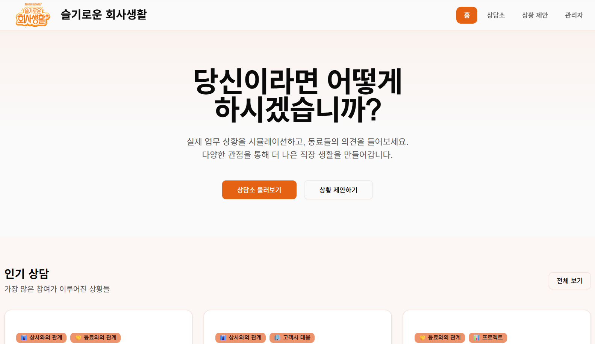
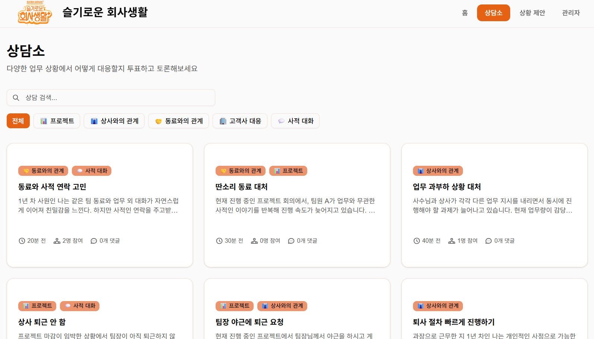
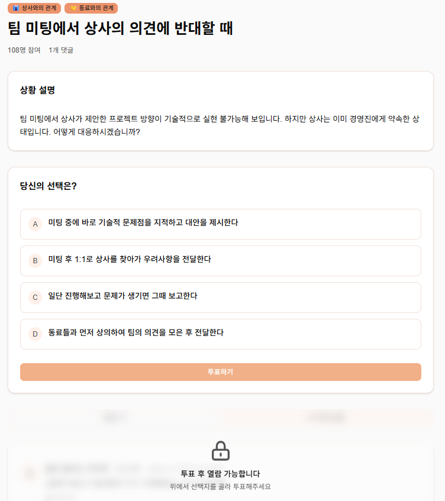
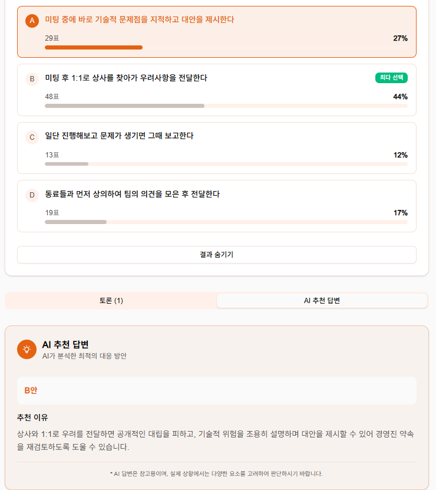
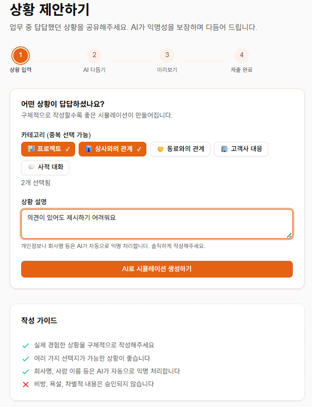
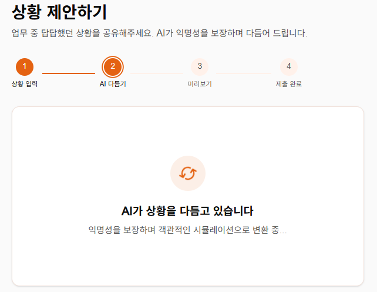
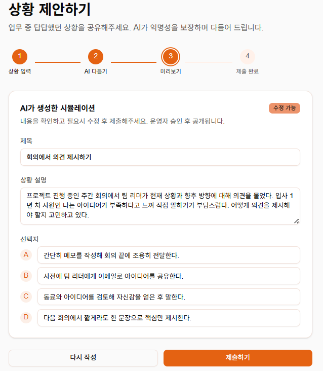
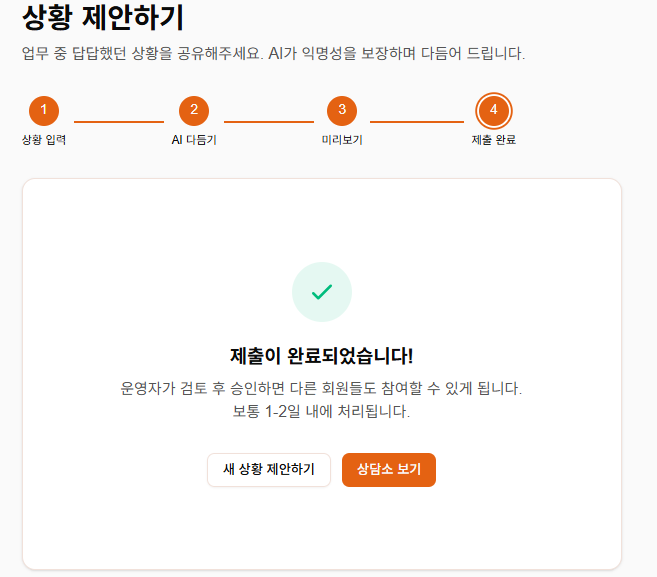
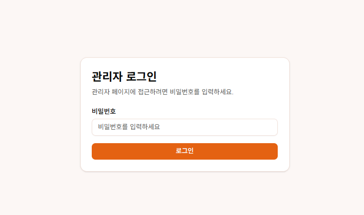
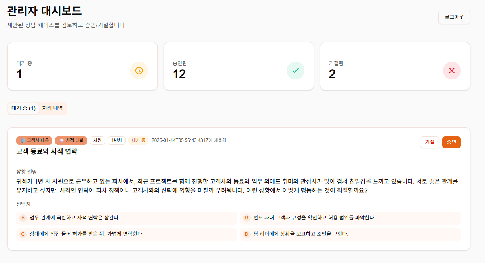

# 🐿️ 슬기로운 회사생활 (WorkWise)

 

> **직장인들을 위한 업무 상황 토론 & 집단지성 커뮤니티**    
"애매한 업무 상황, 우리 회사의 집단 지성으로 해결합니다."

   

---

## 팀 소개


---

## 🧐 About The Project

**슬기로운 회사생활**은 직장 내에서 발생하는 다양한 갈등, 애매한 업무 지시, 인간관계의 고민을 익명으로 털어놓고 동료들의 의견을 듣는 **사내 커뮤니티 플랫폼**입니다.

단순한 익명 게시판의 비방 문화를 지양하고, **구조화된 투표**와 **실제 동료들의 댓글**, 그리고 **AI 기반의 조언**을 더해 실질적인 해결책을 찾으며 모두가 '일잘러'에 가까워질 수 있도록, 그리고 건강한 조직문화를 만들어갈 수 있도록 하기 위한 공론장을 지향합니다.

### 🎯 기획 의도 (Why?)
1. **조직 적응력 향상:** 조직 생활에서 특정한 상황에서 어떻게 행동해야 할지 혼자 고민하는게 아니라, 다양한 의견을 들어봄으로써 조직 생활을 잘 헤쳐나갈 수 있도록 돕습니다.
2. **공감의 격차 해소:** 같은 상황에서도 직급별(신입 vs 팀장)로 판단이 다를 수 있음을 시각화하여 상호 이해를 돕습니다.
3.  **심리적 안전감(Psychological Safety):** 평가에 대한 두려움 없이 자신의 업무 고민을 솔직하게 털어놓을 수 있는 공간을 제공합니다.
4.  **데이터 기반의 조직 문화 진단:** 우리 회사가 '원칙'을 중시하는지, '관계'를 중시하는지 구성원들의 투표 데이터를 통해 파악합니다.

---

## ✨ Key Features

### 1. 딜레마 상황 투표 (Situation Voting)

- 실제 직장 내 상황을 기반으로 2~4개의 선택지 제공
- 선택 후 실시간 투표 결과 확인
- 전체/직급별/관점별 분포 시각화로 조직 내 생각의 간극 확인 가능

### 2. 댓글 기반 토론 (Discussion)
- 구성원들이 선택 이유를 공유하며 실시간 토론
- AI 제안 기능을 통해 상황별 최적 의사결정 방향 서포트
(업무 관점, 관계 관리 관점, 리스크 관점 등)

### 3. 상황 제안하기 (Situation Suggestion)
- 개인이 겪은 실제 고민을 토론 주제로 제안
- AI가 자동으로 신원·회사 식별 요소 제거 + 상황 재구성
- 운영자 검수 후 메인 토론 주제로 게시

---

## 💻 Pages

### 1. 메인 페이지
- **설명:** 프로젝트의 첫 화면으로, 주요 기능과 현재 진행 중인 토론 상황을 한눈에 확인할 수 있습니다.
- **이미지:**  
  

---

### 2. 상담소 목록 탭
- **설명:** 다양한 상담 주제를 한곳에서 확인할 수 있는 페이지입니다. 주제별로 투표 현황과 참여도를 확인할 수 있습니다.
- **이미지:**  
  

---

### 3. 상담소 상세 탭
- **설명:** 선택한 상담 주제의 상세 내용을 확인하고 투표에 참여할 수 있는 페이지입니다.  
- **이미지:**  
  <div style="display: flex; gap: 10px;">
    
    
  </div>

---

### 4. 상황 제안 탭
- **설명:** 사용자가 직접 고민 상황을 입력하고 AI의 도움을 받아 토론 주제를 제안할 수 있는 페이지입니다.  
- **이미지:**  
   <div style="display: flex; flex-wrap: wrap; gap: 10px;">
      
      
      
      
   </div>

---

### 5. 관리자 탭
- **설명:** 관리자 전용 페이지로, 제출된 제안 상황을 검토하고 승인 또는 거절할 수 있습니다.  
- **이미지:**  
  <div style="display: flex; gap: 10px;">
    
    
  </div>

---

## 🛠️ Tech Stack

본 프로젝트는 **Rapid MVP Development**를 목표로 하여, 백엔드 없이 프론트엔드 중심의 아키텍처로 구성되었습니다.

- **Framework:** Next.js, React
- **Styling:** Tailwind CSS
- **UI Component:** Shadcn/UI, Radix UI
- **State Management:** React Context API
- **AI Tooling:** v0.app (UI Generative AI), Github Copilot

---

## 🚀 Getting Started

이 프로젝트를 로컬 환경에서 실행하려면 아래 절차를 따르세요.

### Prerequisites
- Node.js (v18 이상 권장)
- npm 또는 yarn

### Installation

1. 레포지토리를 클론합니다.
   ```bash
   git clone [https://github.com/z00m-1n/wise-company-life.git](https://github.com/z00m-1n/wise-company-life.git)

2. npm을 설치합니다
   ```bash
   npm install

3. localhost로 접속합니다.